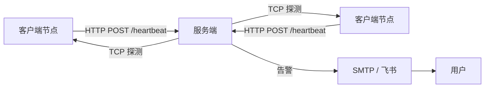
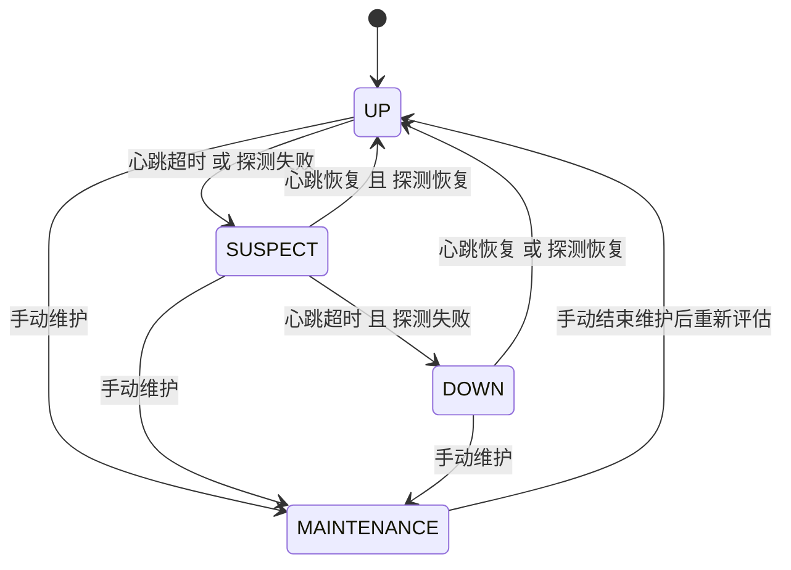
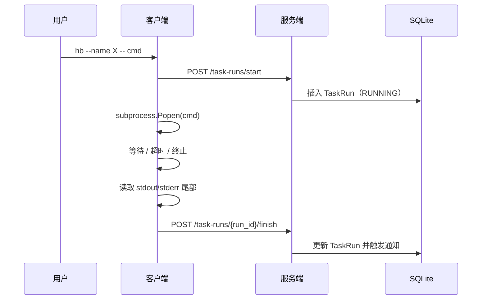

# 架构设计

本文档描述 Heartbeat Monitor 的设计原则、数据模型与内部行为，面向希望理解系统工作原理的维护者与开发者。

---

## 概述

Heartbeat Monitor 是一个轻量级的节点与任务通知系统。它结合 **客户端心跳上报**、**服务端 TCP 主动探测** 与 **任务包装器**（`hb`）来监控节点在线状态和任务执行情况，并通过飞书 Webhook 和/或 SMTP 邮件发送告警。



---

## 设计目标与边界

**范围内：**

1. 节点在线/离线检测
2. 通过 TCP 探测判断关键服务可达性
3. 任务生命周期追踪（开始、结束、成功、失败、超时）
4. 通过飞书和/或邮件发送告警

**范围外：**

- 进程树追踪
- 每秒级 CPU/内存指标
- 分布式任务调度
- 多租户权限控制
- Prometheus 式指标平台

---

## 组件

### 服务端（`server/`）

| 模块 | 职责 |
|------|------|
| `main.py` | FastAPI 入口、APScheduler 生命周期、日志配置 |
| `api.py` | 心跳接收、节点注册、节点 CRUD、维护模式、状态页 |
| `task_api.py` | 任务开始/结束/取消接口、任务查询 API |
| `status_engine.py` | 基于心跳超时与探测失败次数的状态机评估 |
| `probe.py` | 对所有已注册节点执行周期性 TCP 探测 |
| `notification_service.py` | 统一通知分发（邮件 + 飞书）、去重、异步发送 |
| `notifier.py` | SMTP 邮件发送器（`EmailNotifier`） |
| `feishu_notifier.py` | 飞书 Webhook 发送器（`FeishuNotifier`），支持 HMAC 签名 |
| `models.py` | SQLAlchemy 模型：`Node`、`Event`、`TaskRun`、`Notification` |
| `database.py` | SQLite 引擎、会话工厂、建表 |
| `config.py` | 基于 Pydantic 的 YAML 配置加载，含向后兼容处理 |

### 客户端（`client/`）

| 模块 | 职责 |
|------|------|
| `agent.py` | Daemon 主循环：flush spool、发送心跳、休眠 |
| `cli.py` | `hb` 命令行参数解析，委托给 `task_runner` |
| `task_runner.py` | 包装命令：上报开始、执行子进程、捕获日志尾部、上报结束 |
| `heartbeat.py` | 构建并发送心跳负载 |
| `spool.py` | 离线事件的本地 JSON 文件缓存 |
| `config.py` | 基于 Pydantic 的 YAML 配置加载 |

---

## 数据模型

### `Node`

表示一台被监控的机器。

| 字段 | 类型 | 说明 |
|------|------|------|
| `server_id` | `str` | 逻辑唯一标识 |
| `hostname` | `str` | 客户端上报的主机名 |
| `token_hash` | `str` | 认证令牌哈希（共享的 enrollment token） |
| `probe_host` | `str` | TCP 探测目标主机 |
| `probe_port` | `int` | TCP 探测目标端口（默认 22） |
| `expected_interval_sec` | `int` | 预期心跳间隔 |
| `heartbeat_timeout_sec` | `int` | 心跳超时阈值 |
| `probe_fail_threshold` | `int` | 连续探测失败阈值 |
| `status` | `str` | `UP`、`SUSPECT`、`DOWN`、`MAINTENANCE` |
| `last_heartbeat_at` | `str` | 最后一次收到心跳的 ISO 时间戳 |
| `last_probe_at` | `str` | 最后一次探测的 ISO 时间戳 |
| `last_probe_ok` | `int` | 最后一次探测是否成功 |
| `heartbeat_fail_count` | `int` | 连续未收到心跳次数（收到后清零） |
| `probe_fail_count` | `int` | 连续探测失败次数（成功后清零） |
| `last_alert_status` | `str` | 最后一次发送告警时的状态 |
| `last_payload_json` | `str` | 最近一次心跳负载的 JSON |

### `Event`

重大事件的审计日志。

| 字段 | 类型 | 说明 |
|------|------|------|
| `server_id` | `str` | 涉及的节点 |
| `event_type` | `str` | 如 `heartbeat_received`、`probe_failed`、`status_changed`、`task_started`、`node_registered` |
| `message` | `str` | 人类可读描述 |

### `TaskRun`

追踪一次被包装任务的执行。

| 字段 | 类型 | 说明 |
|------|------|------|
| `run_id` | `str` | 16 位十六进制唯一 ID |
| `server_id` | `str` | 执行任务的节点 |
| `task_name` | `str` | 用户提供的任务名称 |
| `command_json` | `str` | 命令数组的 JSON 表示 |
| `cwd` | `str` | 工作目录 |
| `status` | `str` | `STARTING`、`RUNNING`、`SUCCESS`、`FAILED`、`TIMEOUT`、`CANCELLED`、`LOST` |
| `started_at` | `str` | ISO 时间戳 |
| `ended_at` | `str` | ISO 时间戳 |
| `duration_sec` | `float` | 墙钟运行时长 |
| `exit_code` | `int` | 进程退出码 |
| `timeout_sec` | `int` | 配置的超时时间 |
| `stdout_path` / `stderr_path` | `str` | 客户端本地日志文件路径 |
| `stdout_tail` / `stderr_tail` | `str` | 用于通知的日志尾部（约最后 20 行） |
| `notify_on_success` | `int` | 是否在 `SUCCESS` 时发送通知 |

### `Notification`

记录每次通知尝试，用于审计与去重。

| 字段 | 类型 | 说明 |
|------|------|------|
| `source_type` | `str` | `node` 或 `task` |
| `source_id` | `str` | `server_id` 或 `run_id` |
| `event_type` | `str` | 如 `node_down`、`task_failed` |
| `channel` | `str` | `email` 或 `feishu` |
| `subject` | `str` | 通知主题 |
| `payload_json` | `str` | 结构化负载快照 |
| `success` | `int` | 是否发送成功 |
| `response_text` | `str` | 简短响应或错误文本 |

---

## 状态机

节点状态定义：

- `UP`：健康
- `SUSPECT`：发现异常迹象但尚未确认
- `DOWN`：确认离线
- `MAINTENANCE`：手动暂停自动评估



### 评估逻辑（`status_engine.py`）

每次评估周期：

1. **心跳是否超时？**  
   `now - last_heartbeat_at > heartbeat_timeout_sec`

2. **探测是否失败？**  
   `probe_fail_count >= probe_fail_threshold`

3. **状态转换规则：**
   - `UP → SUSPECT`：心跳超时 **或** 探测失败
   - `SUSPECT → DOWN`：心跳超时 **且** 探测失败
   - `SUSPECT → UP`：心跳未超时 **且** 探测未失败
   - `DOWN → UP`：心跳恢复 **或** 探测恢复

`MAINTENANCE` 状态的节点在自动评估中被跳过。

---

## 任务监控

客户端 `hb` 命令包装任意 shell 命令并上报其生命周期。

### 流程



### 超时处理

1. `proc.wait(timeout=timeout_sec)`
2. 发生 `TimeoutExpired` 时：
   - `proc.terminate()`
   - 等待 5 秒；若仍未退出，则 `proc.kill()`
3. 最终状态为 `TIMEOUT`，`exit_code = -1` 或最后返回码

### 日志捕获

- 完整 stdout/stderr 写入客户端本地文件（`agent.log_dir`）
- 仅将 **最后 20 行**（约 8KB 尾部）作为 `stdout_tail`/`stderr_tail` 发送给服务端
- 这样既能控制数据库大小，又能在通知中保留足够的错误上下文

### 离线行为

如果上报 `finish` 时服务端不可达，负载会被保存到本地 spool 目录。Daemon 在每次心跳前会按时间顺序重试补发 spool 中的事件。

---

## 通知系统

### 渠道

- **邮件**：SMTP（465 端口 SSL 或 587 端口 STARTTLS）
- **飞书**：Webhook，可选 HMAC-SHA256 签名验证

### 触发规则

| 事件 | 邮件 | 飞书 |
|------|------|------|
| 节点 `DOWN` | 是 | 是 |
| 节点 `UP`（从 `DOWN` 恢复） | 是 | 是 |
| 任务 `FAILED` | 是 | 是 |
| 任务 `TIMEOUT` | 是 | 是 |
| 任务 `SUCCESS` | 否 | 否 *（除非使用 `--notify-success`）* |
| 任务 `CANCELLED` | 否 | 是 |

### 去重

- **节点**：同一节点在 10 分钟内对同一状态的重复通知会被跳过（通过 `notifications` 表查询）。
- **任务**：每个 `run_id` 的每种终态只发送一次通知。
- **竞态安全**：异步发送前会进行二次内存内去重检查。

### 异步投递

`NotificationService` 使用 `ThreadPoolExecutor(max_workers=5)`，避免慢速 SMTP 或 Webhook 调用阻塞 API 或调度器。

---

## 认证机制

所有客户端请求（心跳、任务开始/结束）均携带 `token` 字段。

- 服务端在 `config/server.yaml` 的 `registration.enrollment_token` 中存储单一的 **enrollment token**。
- 新节点可通过携带该 token 发送心跳来自动注册。
- 当前实现中**没有两阶段注册**，也**没有发放独立节点令牌**。所有节点共享同一个 token。
- `Node.token_hash` 字段存储该共享 token 用于后续校验。

### 接口

- `POST /register` — 显式注册（向后兼容）
- `POST /heartbeat` — 首次心跳时附带自动注册回退逻辑
- `POST /task-runs/*` — 要求 token 与节点存储的 `token_hash` 匹配

---

## Spool（离线缓存）

当客户端无法连接服务端时：

1. **心跳**：完整心跳负载写入 `spool_dir/heartbeat_{timestamp}.json`
2. **任务结束**：结束负载写入 `spool_dir/task_finish_{timestamp}.json`

Daemon 循环（`agent.py`）会在每次发送新心跳前按时间顺序尝试 flush spool。成功 flush 的项目会被删除；失败则停止 flush 以保持顺序。

---

## 部署

### 服务端

推荐方式：systemd 服务（`hb-server.service`），可通过 `setup-server.sh` 安装。

```bash
export SERVER_CONFIG=config/server.yaml
uv run python -m server.main
```

### 客户端

两种使用模式：

1. **Daemon**（`hb-daemon`）：常驻心跳上报 + spool flush
2. **任务包装器**（`hb`）：一次性命令包装

```bash
# Daemon（systemd）
export CLIENT_CONFIG=config/client.yaml
uv run hb-daemon

# 任务包装
hb --name backup --timeout 1800 -- bash backup.sh
```

### 网络韧性

- 所有客户端请求使用短 HTTP 超时（10 秒）
- 本地 spool 防止瞬断导致的数据丢失
- 网络恢复后 daemon 自动恢复上报

---

## 数据库 Schema（SQLite）

表由 `Base.metadata.create_all()` 在启动时自动创建：

- `nodes`
- `events`
- `task_runs`
- `notifications`

当前未管理数据库迁移；schema 演进通过修改模型 + 手动重建数据库处理。
