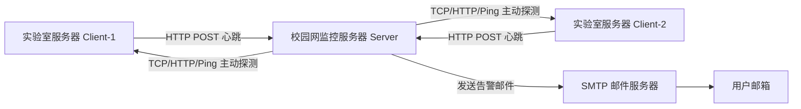
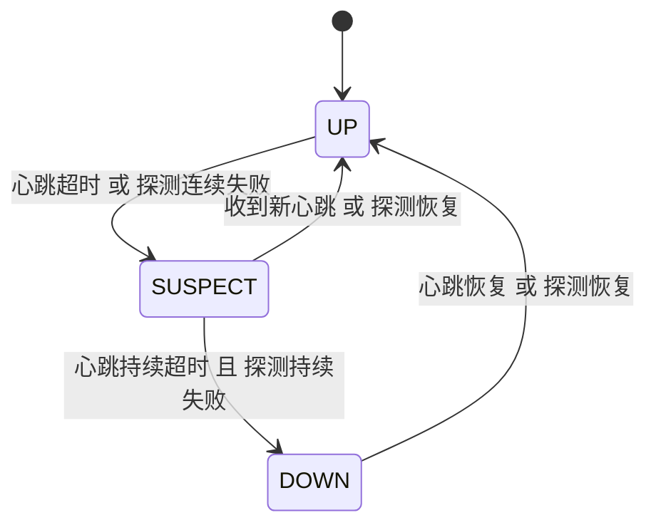
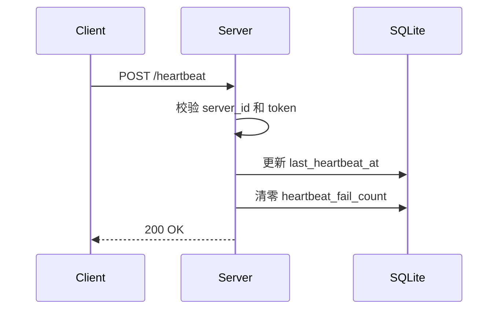
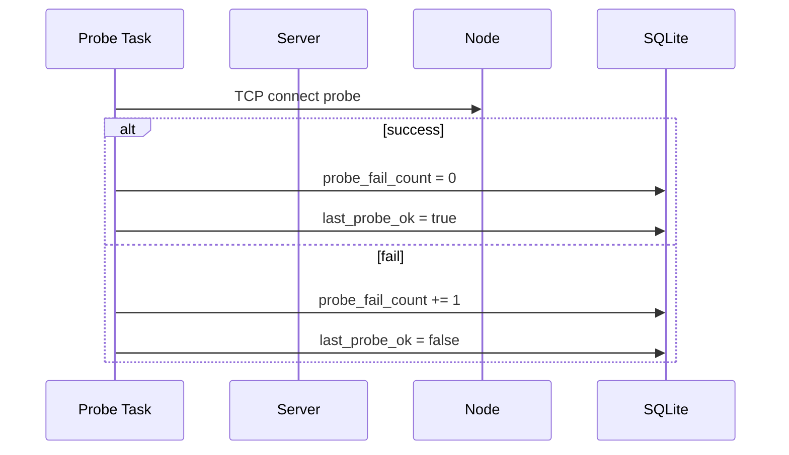
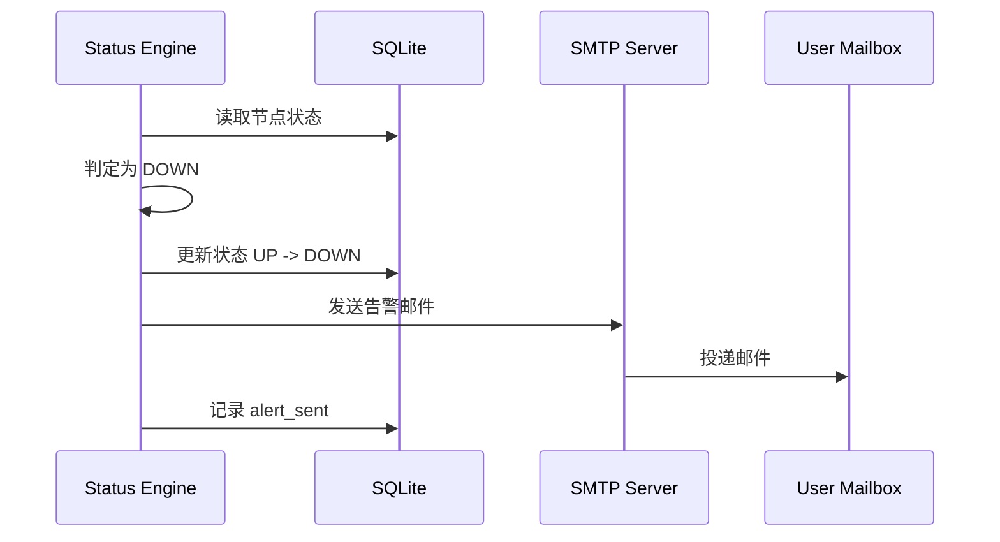

# 内网服务器心跳监测与邮件告警系统设计文档

## 1. 项目概述

本系统用于监测实验室内两台服务器的存活状态，并在异常时通过邮件向指定用户发送告警通知。

系统部署环境如下：

- 1 台位于校园网内部的服务器，作为 **中心监控节点（Server）**
- 2 台实验室服务器，作为 **被监测节点（Client）**
- 监控方式采用：
  - **Client 定时上报心跳**
  - **Server 主动探测 Client**
- 告警方式采用：
  - **SMTP 邮件发送**
- 状态恢复后，系统发送恢复通知邮件

本系统面向小规模部署，强调：

- 实现简单
- 易于部署
- 易于维护
- 状态判断可靠
- 可逐步扩展

------

## 2. 设计目标

### 2.1 功能目标

系统需要支持以下核心能力：

1. 接收被监测节点的定时心跳
2. 主动探测被监测节点的网络连通性或服务可用性
3. 基于心跳与主动探测结果综合判断节点状态
4. 节点异常时发送掉线告警邮件
5. 节点恢复时发送恢复邮件
6. 保存节点当前状态与历史事件日志
7. 提供简单的健康检查与状态查询接口

### 2.2 非功能目标

系统应满足以下非功能需求：

- **可靠性**：避免瞬时网络抖动导致误报
- **可维护性**：代码结构清晰，便于后续修改
- **可扩展性**：后续可扩展到更多节点、更多告警方式
- **轻量化**：不依赖复杂监控平台
- **安全性**：具备基本认证与访问控制

------

## 3. 适用场景与约束

### 3.1 适用场景

本系统适用于以下情况：

- 被监测机器数量较少（2~10 台）
- 监测目标主要是机器是否掉线、SSH 是否可达、服务是否存活
- 监控中心位于可访问被监测节点的网络环境中
- 用户主要需要“及时得知异常”，而不是复杂指标分析

### 3.2 系统约束

本系统当前约束如下：

- 仅采用 **邮件告警**
- 被监测节点数量较少，不需要分布式设计
- 状态存储采用 SQLite，不考虑高并发
- 默认假设监控中心服务器长期在线
- 不依赖外部 SaaS 监控平台

------

## 4. 总体架构

系统采用经典的 **中心化监控架构**。



------

## 5. 架构设计思路

本系统采用“双重检测”机制：

### 5.1 心跳检测

被监测节点定时向中心监控节点上报“我还活着”的信息。

优点：

- 可以从被监测节点视角确认网络与程序状态
- 可附带本机额外状态信息
- 实现简单

缺点：

- 如果 client 进程异常，心跳会中断
- 不能单独代表 server 是否真的不可达

### 5.2 主动探测

中心监控节点主动探测被监测节点，例如：

- TCP 22 端口（SSH）
- HTTP 健康接口
- Ping

优点：

- 可以从监控中心视角判断节点是否可访问
- 能发现目标服务异常

缺点：

- 只能反映“从中心节点看来是否可达”
- 某些服务正常与否未必只靠网络探测就能知道

### 5.3 组合判断

最终状态不依赖单一信号，而是综合：

- 最近心跳是否超时
- 主动探测是否连续失败
- 当前状态与历史状态

这样可以显著降低误报率。

------

## 6. 技术选型

## 6.1 Server 端

建议采用：

- Python 3.11+
- FastAPI：HTTP API 服务
- SQLite：本地状态存储
- SQLAlchemy：数据库访问
- APScheduler 或后台异步任务：定时探测
- smtplib / email：邮件发送
- Uvicorn：运行 API 服务
- systemd：服务管理

### 选择理由

- Python 实现速度快
- FastAPI 适合轻量接口服务
- SQLite 对当前规模完全足够
- 标准库即可完成邮件发送，支持 SSL/STARTTLS，依赖少
- systemd 易于部署与维护

## 6.2 Client 端

建议采用：

- Python 3.11+
- requests：发送 HTTP 心跳
- systemd timer：定时调度脚本

### 选择理由

- Python 脚本便于维护与扩展
- requests 简单稳定
- systemd timer 比 cron 更适合服务化管理

------

## 7. 模块划分

整个系统分为以下模块。

### 7.1 Server 端模块

1. **API 接收模块**
   - 接收 heartbeat 请求
   - 做 token 校验
   - 更新数据库状态
2. **主动探测模块**
   - 定时检查每台节点
   - 支持 TCP / HTTP / Ping 探测
3. **状态判定模块**
   - 根据心跳与探测结果更新节点状态
   - 触发告警与恢复事件
4. **通知模块**
   - 发送掉线/恢复邮件
   - 防止重复发送
5. **存储模块**
   - 保存节点信息
   - 保存状态历史与事件日志
6. **查询模块**
   - 提供当前状态接口
   - 提供历史事件接口

### 7.2 Client 端模块

1. **配置读取模块**
2. **心跳数据采集模块**
3. **HTTP 上报模块**
4. **日志模块**

------

## 8. 系统组件职责

## 8.1 Server 组件职责

### Heartbeat API

负责：

- 接收来自 client 的心跳包
- 校验身份
- 更新节点在线信息

### Probe Scheduler

负责：

- 定时触发主动探测
- 按配置对每台节点执行网络或服务检查

### Status Engine

负责：

- 汇总心跳与探测结果
- 维护状态机
- 决定是否发告警

### Notifier

负责：

- 发送邮件
- 控制通知频率
- 记录发送结果

### Repository / DB Layer

负责：

- 节点配置读取
- 状态持久化
- 事件记录

## 8.2 Client 组件职责

### Heartbeat Sender

负责：

- 周期性发送心跳
- 封装节点基本信息
- 记录失败日志

------

## 9. 监控对象模型

系统中每台被监测服务器视为一个 `Node`。

每个 Node 包含以下属性：

- `server_id`：逻辑唯一标识
- `hostname`：主机名
- `token_hash`：认证 token 哈希
- `probe_host`：主动探测目标地址
- `probe_port`：主动探测端口
- `expected_interval_sec`：预期心跳周期
- `heartbeat_timeout_sec`：心跳超时时间
- `probe_fail_threshold`：主动探测失败阈值
- `status`：当前状态
- `last_heartbeat_at`
- `last_probe_at`
- `last_probe_ok`
- `heartbeat_fail_count`
- `probe_fail_count`
- `last_alert_status`

------

## 10. 状态机设计

节点状态建议分为三种：

- `UP`：正常
- `SUSPECT`：疑似异常
- `DOWN`：确认异常



### 10.1 状态语义

#### UP

表示节点工作正常，至少满足下列之一：

- 最近心跳未超时
- 主动探测成功

#### SUSPECT

表示出现异常迹象，但尚未确认：

- 心跳超时一次或少量连续失败
- 主动探测偶尔失败

此状态通常不触发邮件，只记录日志。

#### DOWN

表示节点已经高度疑似掉线：

- 心跳超时超过阈值
- 主动探测连续失败达到阈值

此状态触发邮件告警。

------

## 11. 判定策略设计

建议参数如下：

- 心跳周期：30 秒
- 心跳超时阈值：90 秒
- 主动探测周期：30 秒
- 探测失败阈值：连续 3 次
- 掉线判定：
  - 心跳超时
  - 且主动探测连续失败
- 恢复判定：
  - 收到新心跳
  - 或主动探测成功

### 11.1 判定逻辑

设当前时间为 `now`。

#### 心跳是否超时

```text
now - last_heartbeat_at > heartbeat_timeout_sec
```

#### 探测是否失败

```text
probe_fail_count >= probe_fail_threshold
```

#### 掉线条件

```text
heartbeat_timeout == true AND probe_failed == true
```

#### 恢复条件

```text
收到新心跳 OR 探测成功
```

### 11.2 为什么不一次失败就报警

因为校园网环境下可能会出现短暂抖动。
如果一次失败就报警，会导致：

- 邮件噪声大
- 用户逐渐忽略告警
- 实际监控体验变差

因此必须采用：

- 心跳超时窗口
- 连续失败计数
- 状态变化触发告警

------

## 12. API 设计

## 12.1 POST /heartbeat

用于 client 上报心跳。

### 请求体

```json
{
  "server_id": "lab-server-1",
  "token": "your-secret-token",
  "hostname": "lab-node-a",
  "timestamp": 1776384000,
  "ip": "10.0.0.12",
  "services": {
    "ssh": true,
    "docker": true
  },
  "meta": {
    "loadavg": "0.10 0.20 0.15",
    "disk_root_used_percent": 61
  }
}
```

### 处理逻辑

1. 校验 `server_id`
2. 若 `server_id` 不存在，且携带的 token 与 Server 配置的 `default_token` 一致，则**自动注册新节点**（将 `ip` 设为默认探测目标），并返回成功
3. 若 `server_id` 已存在，校验 token 是否与该节点记录的 token 一致
4. 更新 `last_heartbeat_at`
5. 更新最近上报内容
6. 将 `heartbeat_fail_count` 清零
7. 若节点原状态为 `DOWN` 或 `SUSPECT`，触发恢复判断

### 响应

成功：

```json
{
  "ok": true,
  "message": "heartbeat received"
}
```

失败：

```json
{
  "ok": false,
  "message": "invalid token"
}
```

## 12.2 GET /health

返回监控中心自身健康状态。

### 响应示例

```json
{
  "ok": true,
  "service": "heartbeat-monitor",
  "time": "2026-04-17T08:00:00+08:00"
}
```

## 12.3 GET /nodes

返回所有节点当前状态。

### 响应示例

```json
[
  {
    "server_id": "lab-server-1",
    "status": "UP",
    "last_heartbeat_at": "2026-04-17T07:59:30+08:00",
    "last_probe_ok": true
  },
  {
    "server_id": "lab-server-2",
    "status": "DOWN",
    "last_heartbeat_at": "2026-04-17T07:54:00+08:00",
    "last_probe_ok": false
  }
]
```

## 12.4 GET /nodes/{server_id}

返回单个节点详细状态。

## 12.5 GET /status-page

返回一个简单的 HTML 可视化页面，展示所有节点当前状态。

- 表格展示 `server_id`、`hostname`、`status`、`last_heartbeat_at`、`last_probe_ok`
- 使用颜色区分状态（绿色=UP，红色=DOWN，黄色=SUSPECT）
- 每 5 秒自动刷新
- 无需额外依赖，直接由 FastAPI 内联返回

------

## 13. 主动探测设计

主动探测建议优先采用 **TCP 探测**。

### 13.1 推荐探测顺序

1. TCP 22（SSH）
2. HTTP 健康接口（如存在）
3. Ping（可选）

### 13.2 为什么优先 TCP

因为 SSH 端口是服务器最常用的基本可管理接口。
若 TCP 22 无法连接，通常说明：

- 机器掉线
- 网络不可达
- SSH 服务异常
- 防火墙或链路异常

相比之下，Ping 的参考价值更弱。

### 13.3 探测实现方式

探测可由 server 每 30 秒执行一次，逻辑如下：

1. 遍历所有节点
2. 对每台节点尝试 TCP connect
3. 记录是否成功
4. 更新 `last_probe_at`
5. 成功则清零 `probe_fail_count`
6. 失败则 `probe_fail_count += 1`

------

## 14. 邮件通知设计

## 14.1 通知触发原则

仅在 **状态发生变化** 时发送邮件：

- `UP -> DOWN`：发送掉线告警
- `DOWN -> UP`：发送恢复通知

对于中间的 `SUSPECT` 状态，默认不发送邮件，只记录日志。

## 14.2 邮件主题规范

### 掉线告警

```text
[ALERT] lab-server-1 is DOWN
```

### 恢复通知

```text
[RECOVERY] lab-server-1 is UP again
```

## 14.3 邮件正文内容

建议包含：

- 节点名称
- 主机名
- 当前状态
- 上次心跳时间
- 最近探测结果
- 触发原因
- 事件时间

### 示例：掉线邮件

```text
Server ID: lab-server-1
Hostname: lab-node-a
Status: DOWN
Last heartbeat: 2026-04-17 07:54:00
Last probe: failed
Reason: heartbeat timeout and tcp probe failed 3 times
Time: 2026-04-17 08:00:30
```

### 示例：恢复邮件

```text
Server ID: lab-server-1
Hostname: lab-node-a
Status: UP
Recovered at: 2026-04-17 08:05:20
Reason: heartbeat received successfully
```

## 14.4 防止重复邮件

每个节点维护 `last_alert_status`。

发送规则：

- 当前状态与 `last_alert_status` 不同时才发送邮件
- 发送成功后更新 `last_alert_status`

这样可避免 DOWN 状态下每轮重复发信。

------

## 15. 数据库设计

采用 SQLite，设计两张核心表。

## 15.1 nodes 表

存当前状态与配置。

```sql
CREATE TABLE nodes (
    id INTEGER PRIMARY KEY AUTOINCREMENT,
    server_id TEXT UNIQUE NOT NULL,
    hostname TEXT,
    token_hash TEXT NOT NULL,
    probe_host TEXT NOT NULL,
    probe_port INTEGER DEFAULT 22,
    expected_interval_sec INTEGER DEFAULT 30,
    heartbeat_timeout_sec INTEGER DEFAULT 90,
    probe_fail_threshold INTEGER DEFAULT 3,
    status TEXT DEFAULT 'UP',
    last_heartbeat_at TEXT,
    last_probe_at TEXT,
    last_probe_ok INTEGER DEFAULT 0,
    heartbeat_fail_count INTEGER DEFAULT 0,
    probe_fail_count INTEGER DEFAULT 0,
    last_alert_status TEXT,
    last_payload_json TEXT,
    created_at TEXT NOT NULL,
    updated_at TEXT NOT NULL
);
```

## 15.2 events 表

存历史事件。

```sql
CREATE TABLE events (
    id INTEGER PRIMARY KEY AUTOINCREMENT,
    server_id TEXT NOT NULL,
    event_type TEXT NOT NULL,
    message TEXT,
    created_at TEXT NOT NULL
);
```

### 15.3 事件类型建议

- `heartbeat_received`
- `heartbeat_timeout`
- `probe_success`
- `probe_failed`
- `status_changed`
- `alert_sent`
- `recovery_sent`
- `auth_failed`
- `node_registered`

------

## 16. Client 端设计

## 16.1 Client 行为

每台 client 定时执行一次：

1. 读取本地配置
2. 获取时间戳、主机名、IP
3. 可选收集少量状态
4. 发送 heartbeat
5. 记录日志

## 16.2 Client 配置示例

```yaml
server_url: "http://campus-monitor.example/heartbeat"
server_id: "lab-server-1"
token: "your-secret-token"
interval_sec: 30
timeout_sec: 5
```

## 16.3 为什么用 systemd timer

相比在脚本里写无限循环，systemd timer 的优势是：

- 进程管理清晰
- 日志统一
- 可自动重试
- 配置独立
- 更符合 Linux 服务管理习惯

------

## 17. 定时任务设计

## 17.1 Server 端定时任务

Server 内部需要两个周期性任务：

### Probe Task

每 30 秒执行：

- 对所有节点主动探测
- 更新探测结果

### Status Evaluation Task

每 30 秒执行：

- 检查心跳是否超时
- 根据探测与心跳更新状态
- 如有状态变化，发送通知

可以将两者做成一个统一调度任务，也可以分开。

## 17.2 Client 端定时任务

每台 client 使用 systemd timer 每 30 秒执行一次 heartbeat 脚本。

------

## 18. 配置设计

系统建议采用 YAML 配置文件。

## 18.1 Server 配置示例

```yaml
listen_host: "0.0.0.0"
listen_port: 8000
default_token: "your-secret-token"

smtp:
  host: "smtp.example.com"
  port: 587
  username: "alert@example.com"
  password: "smtp-password"
  from_addr: "alert@example.com"
  to_addrs:
    - "user1@example.com"
    - "user2@example.com"
  use_tls: true

monitor:
  probe_interval_sec: 30
  evaluation_interval_sec: 30
  default_tcp_timeout_sec: 3

database:
  path: "./monitor.db"

logging:
  level: "INFO"
  file: "./logs/server.log"
```

## 18.2 Client 配置示例

```yaml
server_url: "http://10.x.x.x:8000/heartbeat"
server_id: "lab-server-1"
token: "xxxx"
timeout_sec: 5
```

------

## 19. 日志设计

日志必须清晰，便于排查。

## 19.1 Server 日志内容

建议记录：

- 心跳接收成功/失败
- token 校验失败
- 探测成功/失败
- 状态变更
- 邮件发送成功/失败
- 数据库异常

### 示例

```text
[INFO] heartbeat received from lab-server-1
[WARN] probe failed for lab-server-2: tcp timeout
[INFO] status changed: lab-server-2 UP -> DOWN
[INFO] alert email sent for lab-server-2
```

## 19.2 Client 日志内容

建议记录：

- 心跳发送成功
- 心跳发送失败
- 请求超时
- 配置错误

------

## 20. 安全设计

虽然系统主要运行在校园网内部，但仍需做基本安全控制。

## 20.1 身份认证

Server 在 `config/server.yaml` 中配置一个 `default_token`。

- 对于**首次心跳**（`server_id` 不存在），Server 校验 token 是否等于 `default_token`：
  - 匹配 → 自动注册该 `server_id`，记录其 IP 作为探测目标
  - 不匹配 → 返回 404
- 对于**后续心跳**（`server_id` 已存在），校验 token 是否与该节点记录的 token 一致：
  - 不一致 → 返回 401

## 20.2 IP 限制

如果实验室服务器 IP 固定，可在 server 端设置防火墙规则，仅允许指定来源访问 heartbeat 接口。

## 20.3 HTTPS

如果只在内网使用，可暂时不启 HTTPS。
若未来需要跨网访问，建议加 Nginx / Caddy 反代并启用 TLS。

## 20.4 敏感信息保护

- token 不写入普通日志
- SMTP 密码放入受限配置文件或环境变量
- 配置文件权限设置为仅服务用户可读

------

## 21. 错误处理策略

## 21.1 心跳接口错误

- token 错误：返回 401
- server_id 不存在：返回 404 或 400
- 请求体格式错误：返回 422
- 数据库写入失败：返回 500

## 21.2 邮件发送失败

- 记录错误日志
- 写入 event
- 不应影响主流程状态更新

## 21.3 探测异常

- 捕获 socket timeout、connection refused 等异常
- 视为一次探测失败
- 不因单个节点异常影响整个调度循环

------

## 22. 部署设计

## 22.1 Server 部署

部署内容：

- FastAPI 应用（API 与后台调度合并在同一进程）
- SQLite 文件
- 配置文件
- 日志目录
- systemd service（可选，由 `setup-server.sh` 自动安装）

### 快速部署

运行项目根目录下的交互式脚本：

```bash
./setup-server.sh
```

脚本会自动完成：依赖安装（`uv sync`）、配置生成、可选的 systemd service 安装。

启动服务：

```bash
export SERVER_CONFIG=config/server.yaml
uv run python -m server.main
```

## 22.2 Client 部署

每台 client 部署：

- `client/main.py`
- `config/client.yaml`
- `hb-client.service`
- `hb-client.timer`

### 快速部署

运行项目根目录下的交互式脚本：

```bash
./setup-client.sh
```

脚本会自动完成：依赖安装（`uv sync`）、配置生成、可选的 systemd timer 安装。将 Server 端生成的 `default_token` 填入客户端配置即可。

------

## 23. 时序流程

## 23.1 正常心跳流程



## 23.2 主动探测流程



## 23.3 掉线告警流程



------

## 24. 测试方案

## 24.1 单元测试

重点测试：

- token 校验逻辑
- 心跳超时判定逻辑
- 连续失败计数逻辑
- 状态机转换逻辑
- 邮件发送接口封装逻辑

## 24.2 集成测试

测试场景：

1. client 正常发送心跳，状态保持 UP
2. 停掉某台 client 的心跳脚本
3. 手动阻断某台节点网络
4. 恢复网络或恢复 client
5. 检查邮件发送是否符合预期
6. 检查是否存在重复邮件

## 24.3 故障注入测试

建议人工模拟：

- client 进程退出
- server 无法连接 SMTP
- SQLite 文件权限异常
- 某台节点网络间歇抖动

------

## 25. 运维与维护建议

## 25.1 备份内容

需要定期备份：

- SQLite 数据库
- 配置文件
- systemd unit 文件
- 日志（按需）

## 25.2 监控中心自监控

虽然本设计不强依赖外部服务，但建议后续补充：

- 监控中心本机健康检查
- 邮件发送链路测试
- 外部 dead-man 机制

## 25.3 日志轮转

日志文件建议配合 logrotate 做轮转，避免长期膨胀。

------

## 26. 可扩展方向

后续如果你想继续做大，可以逐步扩展这些功能：

1. 增加 Web 管理界面
2. 支持 Telegram / ntfy / 企业微信等告警渠道
3. 增加节点分组与标签
4. 增加 CPU / 内存 / 磁盘等指标上报
5. 增加认证后台与用户管理
6. 将 SQLite 升级为 PostgreSQL
7. 支持告警抑制、静默时间窗、升级通知

------

## 27. 当前推荐实现版本

对于你当前这个需求，我推荐的第一版实现如下：

### Server

- FastAPI 提供 `/heartbeat`、`/health`、`/nodes`、`/status-page`
- SQLite 存储节点与事件
- 后台任务每 30 秒做主动探测与状态评估
- SMTP 发送告警邮件（支持 465 SSL / 587 STARTTLS / 无 TLS）
- 配置 `default_token`，支持客户端首次心跳自动注册
- `test-smtp.py` 脚本用于快速测试邮件连通性

### Client

- Python 脚本每 30 秒发送一次 heartbeat
- systemd timer 调度
- 配置自定义 `server_id` 和 Server 端统一的 `default_token`

### 部署工具

- `setup-server.sh`：交互式完成依赖安装、配置生成和 systemd service 安装
- `setup-client.sh`：交互式完成依赖安装、配置生成和 systemd timer 安装
- `remove-service.sh`：卸载 systemd 服务

### 默认参数

- 心跳周期：30 秒
- 心跳超时：90 秒
- 探测周期：30 秒
- 探测失败阈值：3 次
- 邮件仅在状态变化时发送

------

## 28. 结论

本设计采用“**client 心跳上报 + server 主动探测 + 状态机判定 + 邮件告警**”的思路，适合你的校园网内实验室服务器监控场景。

它的优点是：

- 结构清晰
- 工程复杂度低
- 误报较少
- 易于部署
- 后续易扩展

对于当前只有两台 client 的规模，这已经是一套很合适、很稳的方案。
